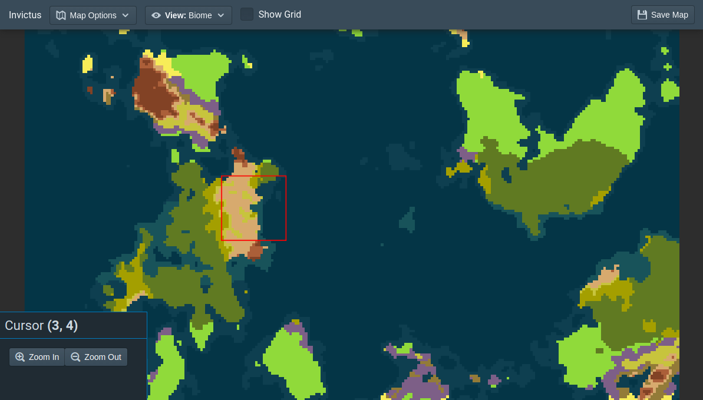

# Invictus

WIP browser game engine.



## Features

* Zoomable procedurally generated world map (world, region, sector, and local
  levels)
* Map views: heightmap, sea level, radiation (temperature), rainfall, and biome
* Adjustable pixel resolution
* Asynchronous worker process architecture for map generation
* Sprite-based randomly generated local map

## Installation

Ensure you have node 7.9.0:

```
$ node --version
7.9.0
```

Checkout the repo.

```
git checkout https://github.com/eranimo/invictus.git
cd invictus
```

Install dependencies.

```
npm install
```

Run webpack and the development server.

```
npm run dev
```

Look for `Project is running at http://localhost:4000/` in the output. Copy and
paste that URL in your browser's URL bar to view the website.
